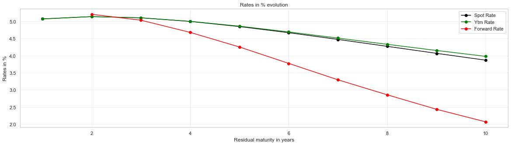
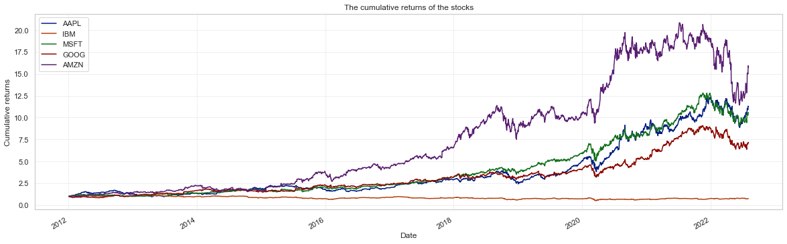

[](https://omarja12.github.io/Bootstrap-Yield-Curve/)

# Bootstrap-Yield-Curve

Bootstrapping the yield curve of a set of Treasury bonds three different ways, then a
short study of five tech stocks. Written as a single Jupyter notebook:
[`Bootstrapping_Yield_Curve.ipynb`](Bootstrapping_Yield_Curve.ipynb).

### → [Read the full write-up](https://omarja12.github.io/Bootstrap-Yield-Curve/)

Five chapters covering the theory from first principles, the three bootstrapping methods,
the rates derived from them, and the results &mdash; with an interactive curve.

---

## Exercise 1 — The yield curve

A `YieldCurve` class takes an `n x 3` array of bonds — maturity, dirty price, coupon rate —
builds the cash-flow matrix, and bootstraps the discount factors.

The input is ten government bonds, maturities 1 to 10 years, par value 100:

| Maturity (y) | 1 | 2 | 3 | 4 | 5 | 6 | 7 | 8 | 9 | 10 |
|---|---|---|---|---|---|---|---|---|---|---|
| Price | 96.60 | 93.71 | 91.56 | 90.24 | 89.74 | 90.04 | 91.09 | 92.82 | 95.19 | 98.14 |
| Coupon (%) | 1.50 | 1.75 | 2.00 | 2.25 | 2.50 | 2.75 | 3.00 | 3.25 | 3.50 | 3.75 |

### Three ways to the same answer

The discount factors are bootstrapped by three independent routes:

- **Matrix operations** — set up the cash-flow matrix and solve the linear system directly
- **Global solver** — minimise the squared error between model and market prices
- **Iterative procedure** — forward substitution, the way the curve would be built by hand

All three return the same vector:

```
[0.9517 0.9046 0.8612 0.8227 0.7892 0.7604 0.7361 0.7156 0.6985 0.6842]
```

and multiplying the cash-flow matrix back through those discount factors reproduces the
ten market prices exactly — which is the check that the bootstrap is correct.

### Derived rates

From the discount factors the class derives spot rates, yield to maturity per bond, and
one-year forward rates.



The curve is humped: spot and YTM peak around year 2 near 5.14% and decline to roughly
3.9% at ten years. The forward curve starts highest at 5.21% and falls much faster,
down to about 2.08% — the usual relationship, since forwards are the marginal rates that
the spot curve averages.

Each series is also plotted on its own:
[spot rates](docs/images/spot_rates.png) ·
[yield to maturity](docs/images/yield_to_maturity.png) ·
[forward rates](docs/images/forward_rates.png)

---

## Exercise 2 — Five stocks

Daily close prices and volumes for **AAPL, IBM, MSFT, GOOG and AMZN**, pulled from Yahoo
Finance through `pandas_datareader` from 1 January 2012 onward.



The section also builds the daily-return correlation matrix, writes one CSV per ticker,
and reads them back into a single combined DataFrame — the round-trip being the point of
the exercise.

---

## Running it

```bash
pip install numpy scipy pandas matplotlib seaborn numpy-financial pandas-datareader yfinance
jupyter lab Bootstrapping_Yield_Curve.ipynb
```

Written against Python 3.9. Exercise 1 needs no network — the bond data is in the
notebook. Exercise 2 fetches from Yahoo Finance; note that `pandas_datareader`'s Yahoo
endpoint has changed since this was written, so that section may need adjusting to run
today. The saved outputs in the notebook are from the original run.

## The write-up

The theory behind all of this &mdash; discount factors, the cash-flow matrix, why the three
methods agree, and why forward rates fall faster than spot rates &mdash; is written up in
full at **[omarja12.github.io/Bootstrap-Yield-Curve](https://omarja12.github.io/Bootstrap-Yield-Curve/)**.

## License

GPL-3.0 — see [LICENSE](LICENSE).
